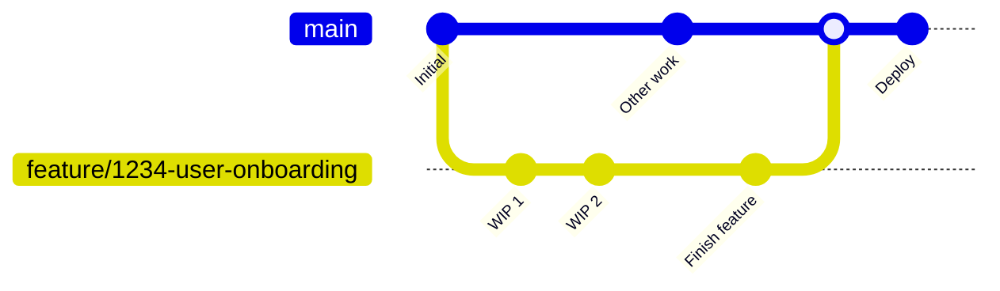

# Project 3 — Branching Development Model (GitHub Flow)

This guide defines a **simple, fast integration model** based on **GitHub Flow** to help your team ship safely and continuously.

> **Why GitHub Flow?** It’s optimized for small batches and continuous integration: short-lived feature branches, frequent merges to `main`, and deployment from `main`.

---

## Branch Types & Naming

- **`main`** — always releasable. Protected branch.
- **`feature/<ticket-id>-<short-name>`** — short-lived branches for changes.
- **`hotfix/<ticket-id>-<short-name>`** — urgent production fixes.
- *(Optional)* **`release/<version>`** — if you need a brief hardening phase.

Examples:  
`feature/1234-user-onboarding`, `hotfix/2345-null-pointer`

---

## Lifecycle (TL;DR)

1. **Create a branch** from `main`:
   ```bash
   git checkout -b feature/1234-user-onboarding origin/main
   ```
2. **Commit small, focused changes** and push:
   ```bash
   git add .
   git commit -m "1234: add onboarding form"
   git push -u origin feature/1234-user-onboarding
   ```
3. **Open a Pull Request** to `main` with:
   - clear title: `<ticket-id>: <summary>`
   - checklist (tests pass, docs updated)
   - link to issue/ticket
4. **CI runs** (lint, build, tests). Review > approve > **merge** using **squash**.
5. **Delete branch** after merge. **Deploy** from `main`.

---

## Visual Workflow (Mermaid)



---

## Pull Request Template (copy into your PR)

**Title:** `<ticket-id>: <concise summary>`

**What & Why**
-

**How tested**
- [ ] Unit tests
- [ ] Local run / screenshots
- [ ] Docs updated (if needed)

**Risks & Rollback**
- Risk:
- Rollback plan:

---

## Branch Protection (recommended)

Protect `main` with:
- Require **Pull Request** before merge
- Require **1+ approving review**
- Require **status checks**: `build`, `test`, `lint` (defined in CI below)
- Disallow **force pushes** and **deletions**
- Dismiss stale reviews on new commits

> GitHub: Settings → Branches → Branch protection rules → *Add rule* → Branch name pattern: `main`

---

## Conventional Commits (optional but helpful)

Use `type(scope): message`, e.g. `feat(auth): add JWT refresh`. Common types: `feat`, `fix`, `docs`, `chore`, `refactor`, `test`, `build`, `ci`.

---

## Example Commands for This Repository

> Replace `<TBD>` with your details where needed.

```bash
# 1) Clone and switch to the target branch
git clone https://github.com/TanV-04/DevOps_Lab_5.git
cd DevOps_Lab_5
git fetch origin
git checkout -b feature/1234-branching-model origin/SohamWandkar

# 2) Add the Project 3 files (this folder) to the repo root or a subfolder:
#    e.g., copy `Project3_Branching_Model/*` into the repo, then:
git add Project3_Branching_Model
git commit -m "1234: add Project 3 — Branching Development Model"
git push -u origin feature/1234-branching-model

# 3) Open a Pull Request: feature -> main (base: main, compare: feature)
#    Review, pass CI, then squash-merge.

# 4) (Optional) Tag a release after merge
git checkout main
git pull --ff-only
git tag -a v0.1.0 -m "Initial branching model"
git push origin v0.1.0
```

---

## Folder Map

```
Project3_Branching_Model/
├─ README.md                  # This guide
├─ CONTRIBUTING.md            # How to work with branches & PRs
├─ CODEOWNERS                 # Default reviewers
├─ .github/
│  └─ workflows/
│     └─ ci.yml               # Starter CI checks for PRs to main
└─ templates/
   └─ PULL_REQUEST_TEMPLATE.md
```

---

## What to Submit

- Open a PR adding this folder to the `SohamWandkar` branch (or create a feature branch from it and PR into `main`).
- Ensure **branch protection** is configured on `main`.
- Include a screenshot of passing CI checks on your PR.
- Include the **Mermaid diagram** above in the README (GitHub renders Mermaid).

Happy shipping!
